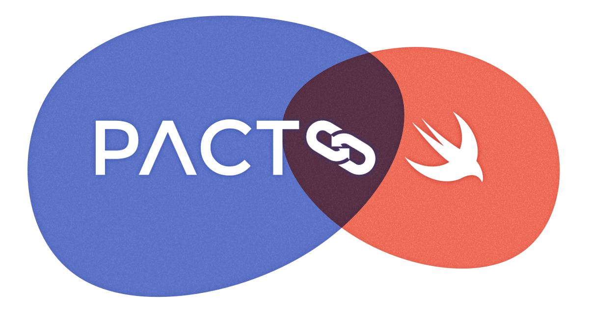

# pact-swift

[][license]
[][contributing]
[][pact-slack]
[][pact-twitter]

<p align="center">
  
</p>

This framework provides a Swift DSL for generating and verifying [Pact][pact-docs] contracts. It provides the mechanism for [Consumer-Driven Contract Testing](https://dius.com.au/2016/02/03/pact-101-getting-started-with-pact-and-consumer-driven-contract-testing/) between dependent systems where the integration is based on HTTP. `PactSwift` allows you to test the communication boundaries between your app and services it integrates with.

`PactSwift` implements (most of) [Pact Specification v4][pact-specification-v4] and runs the mock service "in-process". No need to set up any external mock services, stubs or extra tools 🎉. It supports contract creation along with client verification. It also supports provider verification and interaction with a Pact broker.

## Installation

Note: see [Upgrading][upgrading] for notes on upgrading and breaking changes.

### Swift Package Manager

#### Xcode

1. Enter `https://github.com/pact-reference/pact-swift` in [Choose Package Repository](./Documentation/images/08_xcode_spm_search.png) search bar
2. Optionally set a minimum version when [Choosing Package Options](./Documentation/images/09_xcode_spm_options.png)
3. Add `PactSwift` to your [test](./Documentation/images/10_xcode_spm_add_package.png) target. Do not embed it in your application target.

#### Package.swift

```sh
dependencies: [
  .package(
    url: "https://github.com/pact-foundation/pact-swift.git",
    .upToNextMinor(from: "1.0.0")
  )
]
```

> [!NOTE]
> - `PactSwift` is intended to be used in your [test target](./Documentation/images/11_xcode_carthage_xcframework.png).
> - `PactSwift` supports Apple's arm64 architecture only.

## Writing Pact tests

- Instantiate a `Pact` object by defining [_pacticipants_][pacticipant],
- Instantiate a `PactBuilder` object,
- Define the state of the provider for an interaction (one Pact test),
- Define the expected `request` for the interaction,
- Define the expected `response` for the interaction,
- Run the test by making the API request using your API client and assert what you need asserted,
- When running on CI share the generated Pact contract file with your provider (eg: upload to a [Pact Broker][pact-broker]),
- When automating deployments in a CI step run [`can-i-deploy`][can-i-deploy] and if computer says OK, deploy with confidence!

### Example Consumer Tests

```swift
import XCTest
import PactSwift

@testable import ExampleProject

class PassingTestsExample: XCTestCase {

  var builder: PactBuilder!

  override func setUpWithError() throws {
    try super.setUpWithError()

    guard builder == nil else {
      return
    }

    let pact = try Pact(consumer: "Consumer", provider: "Provider")
      .withSpecification(.v4)

    let config = PactBuilder.Config(pactDirectory: ProcessInfo.processInfo.environment["PACT_OUTPUT_DIR"])
    builder = PactBuilder(pact: pact, config: config)
  }

  // MARK: - Tests

  func testGetUsers() {
    try builder.
      .uponReceiving("A request for a list of users")
      .given(ProviderState(description: "users exist", params: ["first_name": "John", "last_name": "Tester"])
      .withRequest(
        method: .GET,
        path: "/api/users",
      )
      .willRespond(with: 200) { response in
        try response.jsonBody(
          .like(
            [
              "page": .like(1),
              "per_page": .like(20),
              "total": .randomInteger(20...500),
              "total_pages": .like(3),
              "data": .eachLike(
                [
                  "id": .randomUUID(like: UUID()),
                  "first_name": .like("John"),
                  "last_name": .like("Tester"),
                  "renumeration": .decimal(125_000.00)
                ]
              )
            ]
          )
        )
      }

      try await builder.verify { ctx in
        let apiClient = RestManager(baseUrl: ctx.mockServerURL)
        let users = try await apiClient.getUsers()

        XCTAssertEqual(users.first?.firstName, "John")
        XCTAssertEqual(users.first?.lastName, "Tester")
        XCTAssertEqual(users.first?.renumeration, 125_000.00)
      }
    }
  }

  // Another Pact test example...
  func testCreateUser() {
    try builder.
      .uponReceiving("A request to create a user")
      .given(ProviderState(description: "user does not exist", params: ["first_name": "John", "last_name": "Appleseed"])
      .withRequest(.POST, regex: #"^/\w+/group/([a-z])+/users$"#, example:"/api/group/whoopeedeedoodah/users") { request in
        try request.jsonBody(
          .like(
            [
              // You can use matchers and generators here too, but are an anti-pattern.
              // You should be able to have full control of your requests.
              "first_name": "John",
              "last_name": "Appleseed"
            ]
          )
        )
      }
      .willRespond(with: 201) { response in
        try response.jsonBody(
          .like(
            [
              "identifier": .randomUUID(like: UUID()),
              "first_name": .like("John"),
              "last_name": .like("Appleseed")
            ]
          )
        )
      }

      try await builder.verify { ctx in
        let apiClient = RestManager(baseUrl: ctx.mockServerURL)
        let user = try await apiClient.createUser(firstName: "John", lastName: "Appleseed")

        XCTAssertEqual(user.firstName, "John")
        XCTAssertEqual(user.lastName, "Appleseed")
        XCTAssertFalse(user.identifier.isEmpty)
      }
  }
}
```

The `PactBuilder` holds all the interactions between your consumer and a provider. As long as the consumer and provider names remain consistent between tests they will be accumulated into the same output pact `.json`.

Suggestions to improve this are welcome! See [contributing][contributing].

## Generated Pact contracts

Generated Pact contracts are written to the directory configured in the `PactBuilder.Config`.

```swift
  let pact = try Pact(consumer: "Consumer", provider: "Provider")
    .withSpecification(.v4)

  let config = PactBuilder.Config(pactDirectory: ProcessInfo.processInfo.environment["PACT_OUTPUT_DIR"])
  builder = PactBuilder(pact: pact, config: config)
```

## Sharing Pact contracts

If your setup is correct and your tests successfully finish, you should see the generated Pact files in your nominated folder as
`_consumer_name_-_provider_name_.json`.

When running on CI use the [`pact-broker`][pact-broker-client] command line tool to publish your generated Pact file(s) to your [Pact Broker][pact-broker] or a hosted Pact broker service. That way your _API-provider_ team can always retrieve them from one location, set up web-hooks to trigger provider verification tasks when pacts change. Normally you do this regularly in you CI step/s.

See how you can use a simple [Pact Broker Client][pact-broker-client] in your terminal (CI/CD) to upload and tag your Pact files. And most importantly check if you can [safely deploy][can-i-deploy] a new version of your app.

## Provider verification

In your unit tests suite, prepare a Pact Provider Verification unit test:

1. Start your local Provider service
2. Optionally, instrument your API with ability to configure [provider states](https://github.com/pact-foundation/pact-provider-verifier/)
3. Run the Provider side verification step

To dynamically retrieve pacts from a Pact Broker for a provider with token authentication, instantiate a `PactBroker` object with your configuration:

```swift
// The provider being verified
let provider = ProviderVerifier.Provider(port: 8080)

// The Pact broker configuration
let pactBroker = PactBroker(
  url: URL(string: "https://broker.url/")!,
  auth: auth: .token(PactBroker.APIToken("auth-token")),
  providerName: "Your API Service Name"
)

// Verification options
let options = ProviderVerifier.Options(
  provider: provider,
  pactsSource: .broker(pactBroker)
)

// Run the provider verification task
ProviderVerifier().verify(options: options) {
  // do something (eg: shutdown the provider)
}
```

To validate Pacts from local folders or specific Pact files use the desired case.

<details><summary>Examples</summary>

```swift
// All Pact files from a directory
ProviderVerifier()
  .verify(options: ProviderVerifier.Options(
    provider: provider,
    pactsSource: .directories(["/absolute/path/to/directory/containing/pact/files/"])
  ),
  completionBlock: {
    // do something
  }
)
```

```swift
// Only the specific Pact files
pactsSource: .files(["/absolute/path/to/file/consumerName-providerName.json"])
```

```swift
// Only the specific Pact files at URL
pactsSource: .urls([URL(string: "https://some.base.url/location/of/pact/consumerName-providerName.json")])
```

</details>

### Submitting verification results

To submit the verification results, provide `PactBroker.VerificationResults` object to `pactBroker`.

<details><summary>Example</summary>

Set the provider version and optional provider version tags. See [version numbers](https://docs.pact.io/pact_broker/pacticipant_version_numbers) for best practices on Pact versioning.

```swift
let pactBroker = PactBroker(
  url: URL(string: "https://broker.url/")!,
  auth: .token("auth-token"),
  providerName: "Some API Service",
  publishResults: PactBroker.VerificationResults(
    providerVersion: "v1.0.0+\(ProcessInfo.processInfo.environment["GITHUB_SHA"])",
    providerTags: ["\(ProcessInfo.processInfo.environment["GITHUB_REF"])"]
  )
)
```

</details>

For a full working example of Provider Verification see `Pact-Linux-Provider` project in [pact-swift-examples][demo-projects] repository.

## Matching

In addition to verbatim value matching, you can use a set of useful matching objects that can increase expressiveness and reduce brittle test cases.

See [/Sources/Matchers/][pact-swift-matchers] for the supported matchers.

## Example Generators

In addition to matching, you can use a set of example generators that generate random values each time you run your tests.

In some cases, dates and times may need to be relative to the current date and time, and some things like tokens may have a very short life span.

Example generators help you generate random values and define the rules around them.

See [/Sources/ExampleGenerators/][pact-swift-example-generators] for available example generators.

## Demo projects

See [pact-swift-examples][demo-projects] for more examples of how to use `PactSwift`.

## Contributing

See:

- [CODE_OF_CONDUCT.md][code-of-conduct]
- [CONTRIBUTING.md][contributing]

## Acknowledgements

This project takes inspiration from [pact-consumer-swift](https://github.com/DiUS/pact-consumer-swift) and pull request [Feature/native wrapper PR](https://github.com/DiUS/pact-consumer-swift/pull/50).

Logo and branding images provided by [@cjmlgrto](https://github.com/cjmlgrto).

[can-i-deploy]: https://docs.pact.io/pact_broker/can_i_deploy
[code-of-conduct]: ./CODE_OF_CONDUCT.md
[contributing]: ./CONTRIBUTING.md
[demo-projects]: https://github.com/surpher/pact-swift-examples

[license]: LICENSE.md
[pacticipant]: https://docs.pact.io/pact_broker/advanced_topics/pacticipant/
[pact-broker]: https://docs.pact.io/pact_broker
[pact-broker-client]: https://github.com/pact-foundation/pact_broker-client
[pact-docs]: https://docs.pact.io
[pact-slack]: http://slack.pact.io
[pact-swift-example-generators]: https://github.com/surpher/PactSwift/tree/main/Sources/ExampleGenerators
[pact-swift-matchers]: https://github.com/surpher/PactSwift/tree/main/Sources/Matchers
[pact-twitter]: http://twitter.com/pact_up
